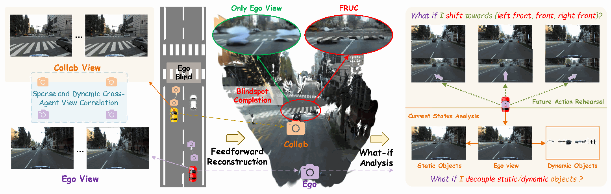

<div align="center">


### Feedforward Dynamic Scene Reconstruction from Uncalibrated Collaborative Driving Views

**NeurIPS 2026**

**Yihang Tao · Yu Guo · Zhengru Fang · Haonan An · Yuguang Fang**<br>
Hong Kong JC STEM Lab of Smart City, City University of Hong Kong

[Paper](https://arxiv.org/pdf/2605.29997) · [Code](https://github.com/yihangtao/FRUC) · [Project page](https://yihangtao.github.io/FRUC/) · [Model weights](https://huggingface.co/yihangtao/fruc)



</div>

FRUC reconstructs dynamic driving scenes from uncalibrated ego and collaborative
RGB views with a feedforward 3D Gaussian splatting model. An **ego-centric causal
occlusion field** models within-agent temporal evolution. **Cross-agent latent
residual denoising** uses the inferred occlusion prior and an ego-only reference
to complete blind spots while protecting reliably observed geometry. Static and
dynamic Gaussians support novel-view rendering and scene editing.

This release contains **FRUC training, cooperative inference and V2X-Real data
preparation**.
Pretrained FRUC weights are available on
[Hugging Face](https://huggingface.co/yihangtao/fruc).

## Installation

Use Linux with an NVIDIA GPU, or Linux under WSL2. Training uses NCCL through
`torchrun`. The starting configuration is Python 3.10, PyTorch 2.4.1 and CUDA
12.1. gsplat compiles its CUDA extension just-in-time on first render, and the
PyTorch wheel does not include `nvcc`, so install the CUDA 12.1 toolkit to match
the provided wheels, together with a compatible C++ compiler. Compiling native
Ada GPU kernels (sm_89, e.g. RTX 5880/4090) requires `nvcc` from CUDA 11.8 or
later; older toolkits fail with `Unsupported gpu architecture`. If several CUDA versions are
installed, point `CUDA_HOME` at the one to use.

```bash
conda create -n fruc python=3.10 pip ninja -y
conda activate fruc
python -m pip install torch==2.4.1 torchvision==0.19.1 \
    --index-url https://download.pytorch.org/whl/cu121
python -m pip install -r requirements.txt

# V2X-Real preprocessing, masks and view-association annotation
python -m pip install -r requirements_data.txt

# Optional 3D viewer and browser-based object editor
python -m pip install -r requirements_demo.txt
```

Alternatively, create the complete environment, including data and demo tools:

```bash
conda env create -f environment.yml
conda activate fruc
```

`environment.yml` selects the CUDA 12.1 PyTorch wheels explicitly. Both installation
paths use Python 3.10, PyTorch 2.4.1 and torchvision 0.19.1. Dependencies are
scoped to the retained paths: gsplat renders Gaussians, scikit-learn supports sky utilities,
LPIPS is used in the training loss, and SegFormer generates masks. This release
does not require xFormers, Open3D, pointops2, a diffusion refiner, or a separate
tracking checkpoint. Transformer attention uses PyTorch's built-in implementation.

```bash
nvcc --version   # CUDA 12.1 is recommended to match the provided PyTorch wheels
python -c "import torch, gsplat; print(torch.__version__, torch.version.cuda, torch.cuda.is_available())"
```

gsplat compiles its CUDA kernels on first use and caches them under
`~/.cache/torch_extensions`, so only the first run is slow. See its
[installation guide](https://github.com/nerfstudio-project/gsplat#installation)
for compatible prebuilt wheels and compiler details. The paper trains on four
NVIDIA RTX 5880 GPUs at 378 × 672 resolution for 10 epochs. Smaller GPU counts
can be selected with `NPROC_PER_NODE`; no minimum VRAM or matching performance
is claimed for an untested device.

## Data and checkpoints

Follow [V2X-Real preparation](datasets/V2XReal.md) to convert raw scenes, generate
sky/dynamic masks, and provide `context.json` camera associations. The cooperative
path orders inputs as `[Ego_t0, Collab_t0, Ego_t1, Collab_t1]`. The loader resizes
RGB images to 378 × 672 and masks with nearest-neighbor sampling.

Dataset camera matrices and ego poses are preserved as metadata. FRUC predicts
rendering cameras from RGB; calibration and LiDAR are not passed to the network.
`context.json` selects view pairs offline and is not camera calibration. The
released cooperative implementation uses two timestamps and one ego/collaborator
pair; broader view-count studies in the paper do not imply unrestricted support
in this entry point.

```text
data/v2xreal/{train,val}/<scene>_<agent>/...
pretrained/vggt/model.pt                 # Optional VGGT backbone initialization
pretrained/fruc/model_fruc_v2xreal.pth   # Released FRUC V2X-Real weights
```

Download the released checkpoint to the path used by the training and inference
launchers:

```bash
python -c "from huggingface_hub import hf_hub_download; hf_hub_download(repo_id='yihangtao/fruc', filename='model_fruc_v2xreal.pth', local_dir='pretrained/fruc')"
```

The same file can be downloaded directly from the
[FRUC checkpoint](https://huggingface.co/yihangtao/fruc/resolve/main/model_fruc_v2xreal.pth).

For optional backbone-only initialization, download the upstream
[VGGT-1B checkpoint](https://huggingface.co/facebook/VGGT-1B/resolve/main/model.pt)
to `pretrained/vggt/model.pt`. VGGT initializes matching backbone parameters;
it is **not a trained FRUC inference checkpoint**. Newly added heads must be
trained. The retained cooperative fine-tuning recipe expects a learned dynamic
prior and freezes the instance head, so VGGT-only weights do not reproduce the
paper's full training procedure. Use a trained FRUC initialization for this
recipe. Follow the upstream checkpoint license.

## Training

Run from the repository root with the FRUC environment active:

```bash
NPROC_PER_NODE=4 \
IMAGE_DIR=data/v2xreal/train \
CKPT_PATH=pretrained/fruc/model_fruc_v2xreal.pth \
LOG_DIR=logs/fruc_v2xreal \
bash scripts/training/fruc/run_v2xreal_coop_train.sh
```

The launcher runs in the foreground and forwards extra trainer arguments. It
uses 10 epochs, a batch size of one per GPU, two timestamps and the cooperative
loss. Checkpoints and visualizations go under the selected log directory. Camera
pairs come from verified context metadata. Add `--cam0_only` only for a verified
ego/collaborator cam0 pair. The trainer requires `--batch_size 1` per GPU;
increase `NPROC_PER_NODE` for distributed training. Single-agent V2X-Real training is available through
`scripts/training/fruc/run_v2xreal_train.sh`.

The FRUC trainer freezes the backbone and trains the Gaussian, depth,
prior-denoising and sky modules. A matching FRUC checkpoint and VGGT weights
represent different initialization states. Loading weights is not a full
optimizer/scheduler resume.

## Inference, novel views and editing

The repository bundles a minimal cooperative example under
`datasets/example/val` so the inference path can be verified without preparing
the full dataset. It contains two scenes from the V2X-Real validation split
(`2023-03-17-16-10-12_1_1` and `2023-04-04-15-43-17_15_0`), each trimmed to two
consecutive timestamps with cameras 0 and 3 from both agents. The example
contains 16 RGB images and their masks, about 8 MB in total. Each cooperative
sample selects two ego views and two collaborator views. After downloading
the released FRUC checkpoint:

```bash
python scripts/visualization/fruc/demo_v2xreal_coop_novel_view.py \
    --image_dir datasets/example/val \
    --ckpt_path pretrained/fruc/model_fruc_v2xreal.pth \
    --output_dir output/example_coop \
    --scene_id 0 --sample_id 0 --offset_scales 0
```

This renders `original_offset_0p0.png`, `edited_offset_0p0.png`,
`compare_offset_0p0.png` and `novel_view_metadata.json` under
`output/example_coop/<scene>/sample_*_frame_*`, together with the four input
views. Use `--scene_id 1` for the second scene, or drop the filters to process
all cooperative samples found in the example.

For the full V2X-Real validation set, prepare it as described in
[V2X-Real preparation](datasets/V2XReal.md) and point `--image_dir` to
`data/v2xreal/val`.

```bash
python scripts/visualization/fruc/demo_v2xreal_coop_novel_view.py \
    --image_dir data/v2xreal/val \
    --ckpt_path pretrained/fruc/model_fruc_v2xreal.pth \
    --output_dir output/fruc_novel_views \
    --scene_id 0 --sample_id 0 \
    --direction_mode lateral_left --offset_scales 0 0.5 1.0
```

Outputs include original/edited renders, side-by-side comparisons, input images
and `novel_view_metadata.json` under each scene/sample directory. Offsets use the
model's reconstructed coordinates, whose scale is not guaranteed to be metric.
Use `--offset_scales 0` for the reference view. Run `--help` for Gaussian editing
and view options. The shell entry is
`scripts/visualization/fruc/run_v2xreal_coop_inference.sh`.

Remove selected dynamic Gaussians to inspect the recovered background:

```bash
python scripts/visualization/fruc/demo_v2xreal_coop_novel_view.py \
    --image_dir data/v2xreal/val \
    --ckpt_path pretrained/fruc/model_fruc_v2xreal.pth \
    --output_dir output/fruc_editing \
    --scene_id 0 --sample_id 0 --offset_scales 0 \
    --remove_all_dynamic --edit_scope all_t0
```

With `requirements_demo.txt` installed, use
`scripts/visualization/fruc/run_visualize_v2xreal_viser.sh` for 3D inspection, or
`scripts/visualization/fruc/run_v2xreal_object_edit_web.sh` for the object editor.
Both accept extra arguments and `IMAGE_DIR` / `CKPT_PATH` environment variables.

## Repository layout

```text
fruc/                         # Backbone, heads, causal occlusion and denoising
datasets/                     # V2X-Real loaders and raw-data conversion
datasets/example/             # Bundled two-scene cooperative inference example
scripts/training/fruc/        # Training entry points
scripts/visualization/fruc/   # Cooperative inference, novel views, editing, viewer
scripts/data_process/         # Masks and view associations
templates/                    # Annotation and object-editor interfaces
docs/                         # Static project page, figures and videos
```

Full datasets, weights, logs and generated outputs are ignored by Git. The
bundled `datasets/example` inference example and project-page media are
intentionally included.

## Citation

```bibtex
@article{tao2026fruc,
  title={{FRUC}: Feedforward Dynamic Scene Reconstruction from Uncalibrated Collaborative Driving Views},
  author={Yihang Tao and Yu Guo and Zhengru Fang and Haonan An and Yuguang Fang},
  journal={arXiv preprint arXiv:2605.29997},
  year={2026},
  url={https://arxiv.org/abs/2605.29997},
}
```

## Acknowledgments and license

FRUC builds on the cooperative driving reconstruction framework from
[DGGT](https://github.com/xiaomi-research/dggt), and uses the visual
geometry backbone from [VGGT](https://github.com/facebookresearch/vggt) with
[gsplat](https://github.com/nerfstudio-project/gsplat) for Gaussian rasterization.
Mask preparation uses the
[Cityscapes SegFormer checkpoint](https://huggingface.co/smp-hub/segformer-b5-1024x1024-city-160k).
Retain [LICENSE](LICENSE), [NOTICE](NOTICE) and upstream file notices. Code and
upstream model checkpoints may have different license terms.
